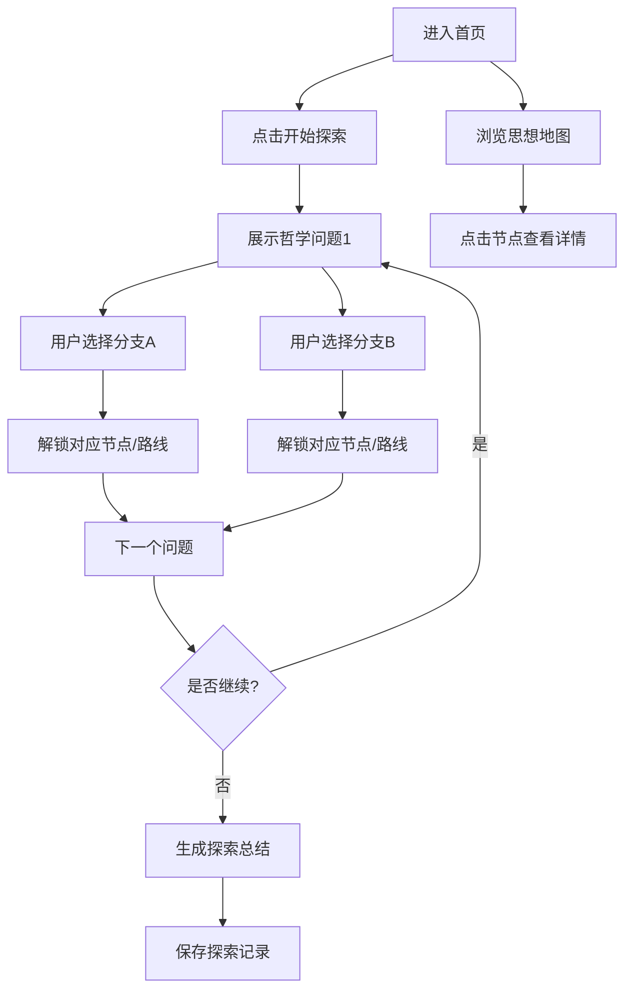

## 1. 产品概述

《思哲迷宫》是一款交互式哲学探索应用，通过思想地图和分支问答引导用户探索不同哲学流派。用户面对核心哲学问题做出选择，系统根据选择导向不同思想路线，最终形成个性化的哲学探索轨迹。

- 目标用户：对哲学感兴趣的普通读者、学生、思考者
- 核心价值：将抽象哲学概念转化为可视化、可交互的探索体验

## 2. 核心特性

### 2.1 功能模块

1. **思想地图首页**：节点展示哲学概念，边展示思想影响关系，支持缩放与交互
2. **哲学问答系统**：一系列深度哲学问题，每个问题提供多个选择方向
3. **路线追踪与记录**：记录用户选择路径，高亮已探索节点，保存探索历史
4. **哲学知识卡片**：点击节点展示该概念/流派的详细介绍

### 2.2 页面详情

| 页面名称 | 模块名称 | 功能描述 |
|----------|----------|----------|
| 思想地图首页 | 节点网络可视化 | SVG/Canvas绘制哲学概念节点，支持拖拽缩放、悬停高亮、点击查看 |
| 思想地图首页 | 探索进度面板 | 展示当前探索路线、已访问节点数、思想倾向统计 |
| 问答页面 | 问题展示区 | 呈现哲学问题，配背景氛围与动画过渡 |
| 问答页面 | 选项卡片 | 2-4个选择方向卡片，hover动效，点击触发路线分支 |
| 知识卡片弹窗 | 概念详情 | 哲学概念/流派的历史背景、代表人物、核心观点介绍 |
| 路线记录页 | 探索历史 | 时间线展示历次探索，可回溯查看具体选择 |

## 3. 核心流程

用户进入首页后看到完整思想地图，可自由浏览节点，或点击"开始探索"进入问答流程。每回答一个问题，根据选择解锁对应思想路线节点，并在地图上高亮路径。可随时暂停查看知识卡片，完成后生成探索总结。

## 4. 用户界面设计

### 4.1 设计风格
- **主色调**：深邃藏青 (#0f1624) + 暗金 (#c9a962) + 迷雾紫 (#6b5b95)，营造古典智慧殿堂氛围
- **次色调**：墨绿 (#1a3a2a) 代表经验主义，深红 (#4a1a1a) 代表存在主义，月白 (#e8e4d9) 为文字色
- **按钮风格**：圆角矩形，细金边，hover时泛起微光扩散效果
- **字体**：标题使用 "Noto Serif SC" 宋体，正文使用 "LXGW WenKai" 楷体，营造典籍质感
- **布局风格**：非对称布局，思想地图居中，信息面板浮于两侧，大量留白呼吸
- **图标风格**：极简线性图标，搭配手写感哲学符号（∞、⚖、☯、✦）

### 4.2 页面设计概览

| 页面名称 | 模块名称 | UI元素 |
|----------|----------|--------|
| 思想地图首页 | 节点网络 | 动态光晕节点，贝塞尔曲线连接线，呼吸脉冲动画，节点悬停放大显示名称 |
| 思想地图首页 | 顶部标题栏 | 应用名+副标题，渐变文字效果，右上角用户探索统计 |
| 问答页面 | 问题展示 | 大号衬线字体，居中排版，淡入动画，背景为流动的星空渐变 |
| 问答页面 | 选项卡片 | 毛玻璃质感，金边描边，悬停上浮+发光，点击时触发粒子扩散 |
| 知识卡片弹窗 | 详情面板 | 从侧边滑入，羊皮纸纹理背景，竖排标题+横排正文，分章节排版 |
| 路线记录页 | 时间线 | 垂直时间线，节点图标+日期+摘要，点击展开详情 |

### 4.3 响应式
- 桌面端优先设计，思想地图自适应屏幕尺寸
- 平板端：侧边面板收起为底部抽屉
- 移动端：地图简化为可滚动节点列表，问答全屏展示

## 5. Mock数据规划

### 5.1 哲学概念节点（约20+个）
- 古希腊：苏格拉底、柏拉图、亚里士多德、斯多葛学派
- 近代理性：笛卡尔、斯宾诺莎、莱布尼茨
- 经验主义：洛克、贝克莱、休谟
- 德国古典：康德、黑格尔、叔本华
- 现代思潮：尼采、存在主义、功利主义、马克思

### 5.2 哲学问题（约8-10个核心问题）
- 自由是否比安全更重要？
- 真理是否客观存在？
- 幸福是否高于正义？
- 个体意志还是集体利益？
- 知识来源于理性还是经验？
- 人生是否有先验意义？

### 5.3 分支路线
- 理性主义路线 vs 经验主义路线
- 功利主义路线 vs 义务论路线
- 存在主义路线 vs 本质主义路线
