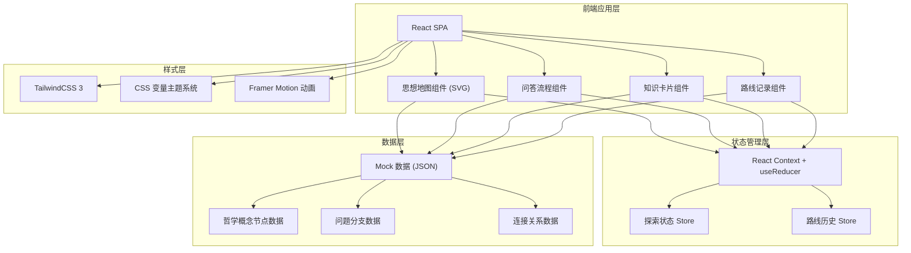

## 1. 架构设计



## 2. 技术描述

- **前端框架**：React@18 + TypeScript
- **构建工具**：Vite@5
- **样式方案**：TailwindCSS@3 + CSS Variables
- **动画库**：Framer Motion
- **状态管理**：React Context + useReducer（无需 Redux，复杂度适中）
- **数据存储**：LocalStorage 持久化探索记录
- **地图渲染**：原生 SVG + 自定义力导向布局（轻量，无需引入 D3）
- **后端**：无，纯前端应用，使用 Mock 数据

## 3. 路由定义

| 路由 | 用途 |
|------|------|
| `/` | 思想地图首页 |
| `/explore` | 哲学问答探索流程 |
| `/record` | 探索历史记录 |
| `/concept/:id` | 哲学概念详情（可通过弹窗替代） |

## 4. 数据模型

### 4.1 哲学概念节点 (PhilosophyNode)

```typescript
interface PhilosophyNode {
  id: string;
  name: string;           // 概念名称，如"康德"
  category: 'ancient' | 'rationalism' | 'empiricism' | 'german' | 'modern';
  description: string;    // 简介
  detail: string;         // 详细介绍
  keyFigures: string[];   // 代表人物
  coreIdeas: string[];    // 核心观点
  era: string;            // 时期
  x: number;              // 地图x坐标（归一化0-1）
  y: number;              // 地图y坐标（归一化0-1）
  color: string;          // 节点颜色
}
```

### 4.2 连接关系 (PhilosophyEdge)

```typescript
interface PhilosophyEdge {
  id: string;
  source: string;  // 源节点ID
  target: string;  // 目标节点ID
  relation: '继承' | '批判' | '发展' | '影响';
  description?: string;
}
```

### 4.3 哲学问题 (Question)

```typescript
interface Question {
  id: string;
  text: string;            // 问题描述
  context?: string;        // 背景补充
  order: number;           // 展示顺序
  options: QuestionOption[];
}

interface QuestionOption {
  id: string;
  text: string;            // 选项文案
  shortLabel: string;      // 短标签，用于路线显示
  unlockNodes: string[];   // 解锁的节点ID
  routeTags: string[];     // 路线标签，如['理性主义','义务论']
  nextQuestionId?: string; // 下一问题ID（支持分支）
  feedback: string;        // 选择后的哲思反馈
}
```

### 4.4 探索记录 (ExplorationRecord)

```typescript
interface ExplorationRecord {
  id: string;
  startedAt: number;
  completedAt: number;
  path: {
    questionId: string;
    optionId: string;
    timestamp: number;
  }[];
  unlockedNodes: string[];
  routeTags: Record<string, number>;  // 标签 => 得分
  summary?: string;
}
```

### 4.5 应用状态 (AppState)

```typescript
interface AppState {
  currentView: 'map' | 'explore' | 'record';
  currentQuestionId: string | null;
  unlockedNodes: string[];
  exploredEdges: string[];
  currentPath: ExplorationRecord | null;
  records: ExplorationRecord[];
}
```

## 5. 文件结构

```
src/
├── components/
│   ├── map/
│   │   ├── PhilosophyMap.tsx      # 思想地图主组件
│   │   ├── MapNode.tsx            # 单个节点组件
│   │   ├── MapEdge.tsx            # 连接线组件
│   │   └── MapControls.tsx        # 缩放控制
│   ├── explore/
│   │   ├── ExploreFlow.tsx        # 问答流程主组件
│   │   ├── QuestionCard.tsx       # 问题卡片
│   │   └── OptionCard.tsx         # 选项卡片
│   ├── common/
│   │   ├── ConceptModal.tsx       # 概念详情弹窗
│   │   ├── NavHeader.tsx          # 顶部导航
│   │   └── RoutePanel.tsx         # 路线面板
│   └── record/
│       ├── RecordList.tsx         # 历史列表
│       └── RecordTimeline.tsx     # 时间线展示
├── data/
│   ├── nodes.ts                   # 节点mock数据
│   ├── edges.ts                   # 连接线mock数据
│   └── questions.ts               # 问题mock数据
├── context/
│   └── AppContext.tsx             # 全局状态
├── hooks/
│   └── useExploration.ts          # 探索逻辑hook
├── types/
│   └── index.ts                   # TypeScript类型定义
├── utils/
│   └── storage.ts                 # LocalStorage工具
├── App.tsx
├── main.tsx
└── index.css
```

## 6. 性能与体验要点

1. 思想地图使用 SVG 渲染，节点数控制在 30 以内，保证流畅
2. 节点动画使用 CSS transform，避免重排
3. 探索记录使用 LocalStorage 异步持久化，不阻塞 UI
4. 路由切换使用 Framer Motion 做页面过渡
5. 图片/字体资源按需加载，首屏只加载思想地图核心资源
